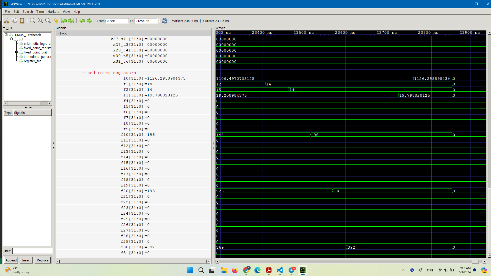

Computer Organization - Spring 2024
==============================================================
## Iran Univeristy of Science and Technology
## LUMOS
LUMOS is a multicycle RISC-V processor that implements a subset of RV32I instruction set, designed for educational use in computer organization classes at Iran University of Science and Technology. It allows for modular design projects, enabling students to gain hands-on experience with processor architecture.

- Name: Ali Hemmati
- Team Members: Amirhosein Sharifi , Abdolah Khalaj
- Student ID: 400414012 , ۴۰۰۴۱۲۳۵۵ , 400412004
- Date: 1403/4/12

## Report

- Radical
This code implements a simplified version of the Newton-Raphson algorithm for approximating the square root of a positive number. The algorithm iteratively refines an initial guess to converge towards a more accurate estimate of the square root.

Here’s how the code works:

It defines several registers (reg) to store intermediate values:
root: The current estimate of the square root.
root_ready: A flag indicating whether the root calculation is complete.
CopyOprand1: A copy of the input operand (Operand1).
pair: A two-bit register storing the most significant bits of CopyOprand1.
Iteration: The number of iterations (set to 16 in this code).
radicand: An intermediate value used in the calculation.
Subb1: An intermediate value representing root << 2 + 1.
SubResult: The result of the subtraction operation.
co_SubResult: A temporary storage for SubResult.
The always @(*) block is a combinational logic block that executes whenever any of its inputs change.
Inside the loop (for (i = 0; i < Iteration; i = i + 1)):
It extracts the two most significant bits of CopyOprand1 and stores them in pair.
Calculates radicand by shifting SubResult left by 2 and adding pair.
Calculates Subb1 by shifting root left by 2 and adding 1.
Updates SubResult by subtracting Subb1 from radicand.
If SubResult is non-zero, it updates root by shifting it left by 1 and adding 1; otherwise, it only shifts root left by 1.
Finally, CopyOprand1 is shifted left by 2 for the next iteration.
The result of this process is an approximation of the square root stored in root.
- Multiply
This code represents a hardware multiplier circuit that computes the product of two 64-bit operands (operand_1 and operand_2). Let’s break down how it works:

Input Preparation:
The code splits each 64-bit operand into two 32-bit halves (multiplierCircuitInput1L, multiplierCircuitInput1H, multiplierCircuitInput2L, and multiplierCircuitInput2H).
The lower 16 bits of operand_1 are stored in multiplierCircuitInput1L, and the upper 16 bits are stored in multiplierCircuitInput1H.
Similarly, the lower 16 bits of operand_2 are stored in multiplierCircuitInput2L, and the upper 16 bits are stored in multiplierCircuitInput2H.
Multiplier Circuits:
Four instances of a multiplier circuit (multiplier_circuit1, multiplier_circuit2, multiplier_circuit3, and multiplier_circuit4) are instantiated.
Each multiplier circuit takes two 16-bit inputs and produces a 32-bit product (multiplierCircuitResult1, multiplierCircuitResult2, multiplierCircuitResult3, and multiplierCircuitResult4).
Partial Products:
Four partial products (partialProduct1, partialProduct2, partialProduct3, and partialProduct4) are initialized to zero.
In the always (*) block:
The results from each multiplier circuit are added to their corresponding partial products.
The lower 32 bits of each result are stored in the partial product.
The upper 32 bits of each result are shifted left by 16 or 32 bits and added to the partial product.
Final Product:
The final product (product) is obtained by summing up all four partial products.
The product_ready flag is set to indicate that the product calculation is complete.
Note:
The code snippet is incomplete (missing module definitions, port connections, and other details).
You would need to complete the missing parts (e.g., define the Multiplier module) and ensure proper connections for this code to function correctly.
- Result Img
